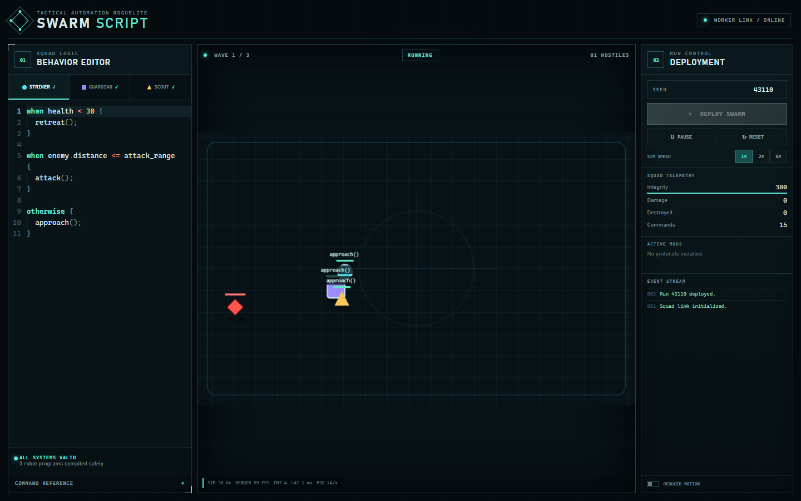
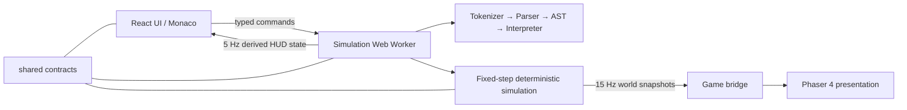

# Swarm Script

**Program a three-robot squad, then watch its rules survive a fast deterministic arena run.**

Swarm Script is a desktop-first automation roguelite vertical slice. Each robot runs a small, safe rule language; the same seed and scripts always produce the same outcome, while a dedicated worker keeps combat independent from rendering.



## Playable now

- Three distinct robots—Striker, Guardian, and Scout—with editable working scripts
- A Monaco-powered language editor with highlighting, completion, and friendly diagnostics
- Continuous top-down movement, projectiles, energy, health, waves, upgrades, victory, and defeat
- Three deterministic waves with three seeded upgrade choices between waves
- 1×, 2×, and 4× simulation speed, pause, reset, reduced motion, metrics, and event feed
- Procedural tactical visuals, interpolated movement, trails, hit flashes, decision labels, and death bursts
- Real run analysis with per-robot contribution, observations, and a deterministic checksum

## Local setup

Requirements: Node.js 24 LTS and pnpm 11.9+.

```bash
pnpm install
pnpm dev
```

Open the URL printed by Vite. No backend, account, or environment variables are required.

| Command             | Purpose                                                 |
| ------------------- | ------------------------------------------------------- |
| `pnpm dev`          | Start the web app                                       |
| `pnpm build`        | Build every workspace package and the production client |
| `pnpm test`         | Run scripting, simulation, and worker tests             |
| `pnpm test:e2e`     | Run the browser smoke test                              |
| `pnpm lint`         | Run ESLint                                              |
| `pnpm typecheck`    | Check strict TypeScript across packages                 |
| `pnpm format:check` | Check Prettier formatting                               |
| `pnpm verify`       | Run the complete local verification sequence            |

## Architecture



- `packages/shared` owns serializable domain and worker contracts.
- `packages/scripting` owns tokenization, AST construction, validation, diagnostics, and budgeted interpretation.
- `packages/simulation` owns all authoritative state and rules; it has no React, Phaser, or DOM dependency.
- `apps/web` owns Monaco, React controls, the worker host, and a thin Phaser view.

The simulation advances at 30 fixed steps per second. It publishes rendering snapshots at 15 Hz; Phaser interpolates positions at render cadence. React is throttled to roughly 5 Hz for HUD data and never rerenders the canvas entity graph.

See [Architecture](docs/ARCHITECTURE.md), [Game design](docs/GAME_DESIGN.md), and [Roadmap](docs/ROADMAP.md).

## Why the DSL is safe

Source text is tokenized and parsed into a typed AST. Static validation accepts only six readable values, six comparison operators, three boolean operators, and five commands. The interpreter walks that AST with a configurable instruction budget. It never uses `eval`, `Function`, dynamic imports, generated JavaScript, or host-object access. Every decision includes the source span of the rule that fired.

## Determinism

The simulation uses fixed timesteps, stable entity IDs, ordered systems, and a local xorshift32 generator. Authoritative code does not call `Math.random()`. Upgrade selection uses the same seeded generator. A stable FNV-1a checksum covers final state, metrics, and upgrades, making replay regressions observable in tests and on the result screen.

## Testing strategy

The Vitest suite covers lexical spans, precedence, invalid syntax, first-match behavior, instruction limits, seeded repeatability, combat, cooldowns, damage, death, waves, upgrades, win/loss, metrics, and worker messages. Playwright boots the real app, checks compilation and canvas creation, deploys a short deterministic run, changes speed, pauses, resumes, reaches an upgrade/result state, checks console errors, and validates the 1024×768 layout.

## Performance decisions

- Fixed-size serializable snapshots cross the worker boundary; renderer objects never do.
- React receives throttled derived data while the Phaser bridge receives every render snapshot.
- Continuous positions are interpolated to avoid tying presentation to simulation cadence.
- Phaser and Monaco load as separate runtime chunks; the arena uses one retained static grid plus two reused `Graphics` objects for dynamic world and effects.
- Entity counts stay bounded per encounter; hot combat loops avoid higher-order allocations where it matters.
- A development overlay reports simulation rate, render FPS, entity count, snapshot latency, and message rate.

## Current limitations

- Balance is an initial portfolio-quality pass, not a broad playtest-derived curve.
- The rule language has no user variables, functions, squad messages, or step debugger yet.
- Runs are deterministic but replay files and shareable challenge links are not implemented.
- Procedural audio is intentionally deferred; the vertical slice is visual-only.
- Desktop widths below 1024 px and mobile controls are outside v0.1 scope.

## Technical highlights

Strict TypeScript package boundaries, a hand-built safe language pipeline, fixed-step deterministic simulation, typed Web Worker messages, renderer/simulation separation, and real browser automation make the project useful both as a game and as an engineering portfolio piece.

## Roadmap

The next release deepens script debugging and squad coordination before adding meta-progression, daily challenges, replay sharing, and release preparation. The staged plan lives in [docs/ROADMAP.md](docs/ROADMAP.md).

## License

[MIT](LICENSE)
