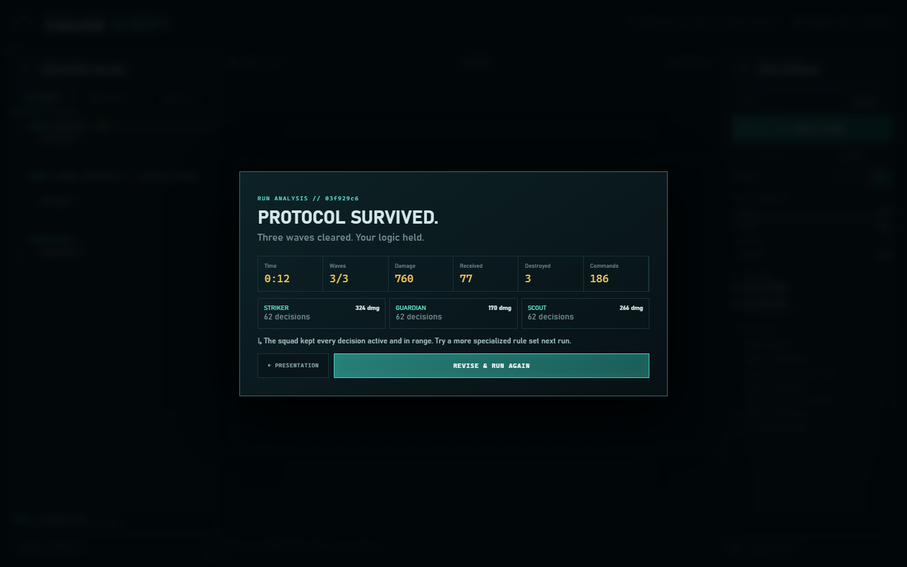
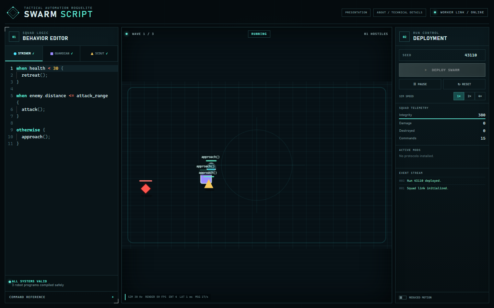
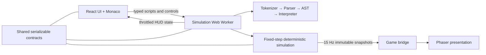

# Swarm Script

**Program your squad. Watch the logic fight.**

Swarm Script is a desktop-first tactical automation game about programming three robots with a small, safe rule language, then watching those rules fight through a deterministic three-wave arena run.

[Play the live game](https://swarm-script.vercel.app/) · [Technical architecture](https://swarm-script.vercel.app/architecture) · [Detailed architecture notes](docs/ARCHITECTURE.md)



## Why this project matters

Swarm Script is a compact game that makes its engineering visible. The player-facing mechanic is the same system being demonstrated: source text becomes a validated AST, runs inside a budgeted interpreter, drives an authoritative fixed-step simulation in a Web Worker, and reaches a separate Phaser renderer through typed snapshots.

The project is intentionally narrow—three robots, three waves, one complete run—so the language tooling, deterministic simulation, rendering boundary, responsive presentation, and automated browser flow can all be finished and verified rather than hidden behind a larger feature list.

## Gameplay

1. Open [the live game](https://swarm-script.vercel.app/play) on a desktop viewport at least 1024 pixels wide.
2. Edit the Striker, Guardian, and Scout behavior rules. The default scripts already compile and are ready to run.
3. Select **Deploy Swarm** and watch each robot execute the first matching rule.
4. Choose a squad protocol after waves one and two.
5. Survive wave three to reach the run analysis and deterministic checksum.

The run controls also provide pause, reset, 1×/2×/4× speed, a numeric seed, reduced motion, squad telemetry, and an event stream.



## Technical highlights

- Hand-built tokenizer, recursive-descent parser, typed AST, static validation, diagnostics, and budgeted interpreter—no `eval`, generated JavaScript, or host-object access.
- Deterministic 30 Hz simulation with stable entity order, seeded xorshift32 randomness, ordered upgrades, and an FNV-1a final checksum.
- Typed Web Worker protocol keeps combat independent from React, Monaco, Phaser, and browser rendering cadence.
- Phaser renders immutable snapshots while React receives separately throttled HUD state.
- Strict TypeScript monorepo boundaries across shared contracts, scripting, simulation, and the web client.
- Vitest coverage for the language, simulation, and worker host, plus Playwright coverage of the real three-wave browser flow.
- Phaser and Monaco ship as lazy runtime chunks with visible loading and failure states.

## Architecture



- `packages/shared` owns serializable domain types and worker messages.
- `packages/scripting` owns parsing, validation, diagnostics, and interpretation.
- `packages/simulation` owns all authoritative combat state and rules, with no DOM or renderer dependency.
- `apps/web` owns the React presentation, Monaco editor, worker host, and Phaser view.

See [docs/ARCHITECTURE.md](docs/ARCHITECTURE.md) for the worker protocol, state ownership, deterministic replay model, performance model, and trade-offs.

## Local development

Requirements: Node.js 24 and pnpm 11.9+.

```bash
pnpm install --frozen-lockfile
pnpm dev
```

Open the URL printed by Vite. No backend, account, environment variable, or external service is required to play locally.

## Test and verification commands

| Command             | Purpose                                                                             |
| ------------------- | ----------------------------------------------------------------------------------- |
| `pnpm verify`       | Run lint, formatting, type checks, unit/integration tests, build, and browser tests |
| `pnpm test:e2e`     | Run the Playwright gameplay and responsive presentation suite                       |
| `pnpm build`        | Build every workspace package and the Vite production client                        |
| `pnpm test`         | Run scripting, simulation, and worker-host tests                                    |
| `pnpm typecheck`    | Check strict TypeScript across all packages                                         |
| `pnpm lint`         | Run ESLint                                                                          |
| `pnpm format:check` | Check Prettier formatting                                                           |

To run the same browser suite against a deployment:

```bash
PLAYWRIGHT_BASE_URL=https://swarm-script.vercel.app pnpm test:e2e
```

In PowerShell, use `$env:PLAYWRIGHT_BASE_URL='https://swarm-script.vercel.app'` before the test command.

## Current limitations

- The playable game requires a desktop viewport at least 1024 pixels wide; smaller screens receive a friendly presentation-only fallback.
- Balance is an initial portfolio-quality pass, not a broad playtest-derived curve.
- The rule language has no user variables, functions, robot-to-robot messages, or step debugger.
- Runs are deterministic, but replay files and shareable challenge links are not implemented.
- The game is visual-only; audio is not implemented.
- Procedural geometric rendering is deliberately compact and does not use an external asset pipeline.

## Deployment

The production client is deployed from the repository root with [vercel.json](vercel.json). It installs the committed pnpm lockfile, builds `@swarm-script/web`, serves `apps/web/dist`, and rewrites direct routes to the Vite entry point.

## License

[MIT](LICENSE)
