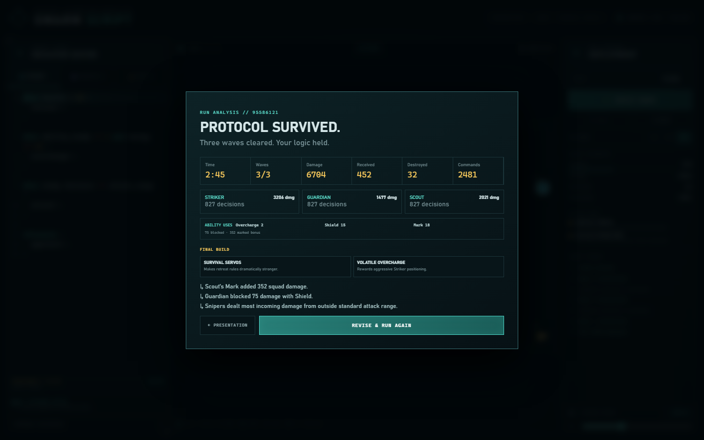
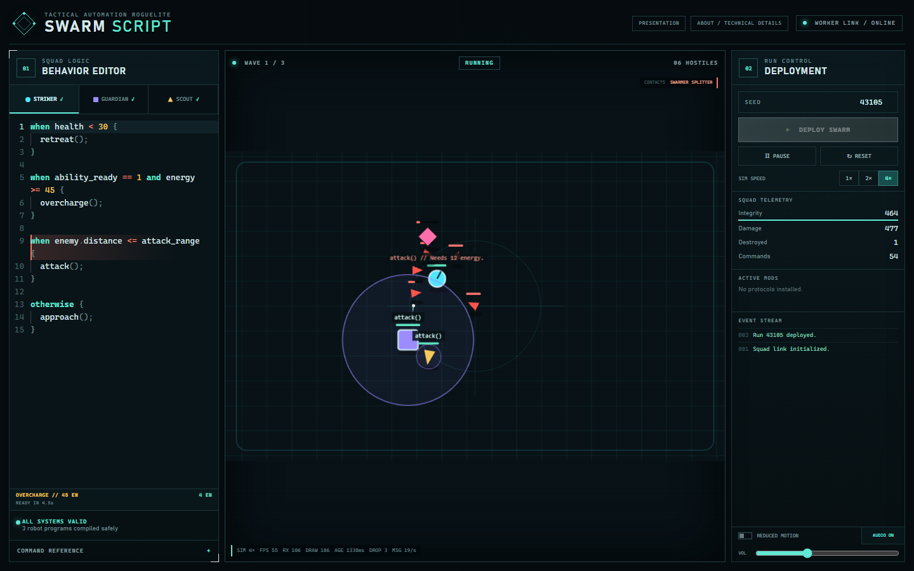
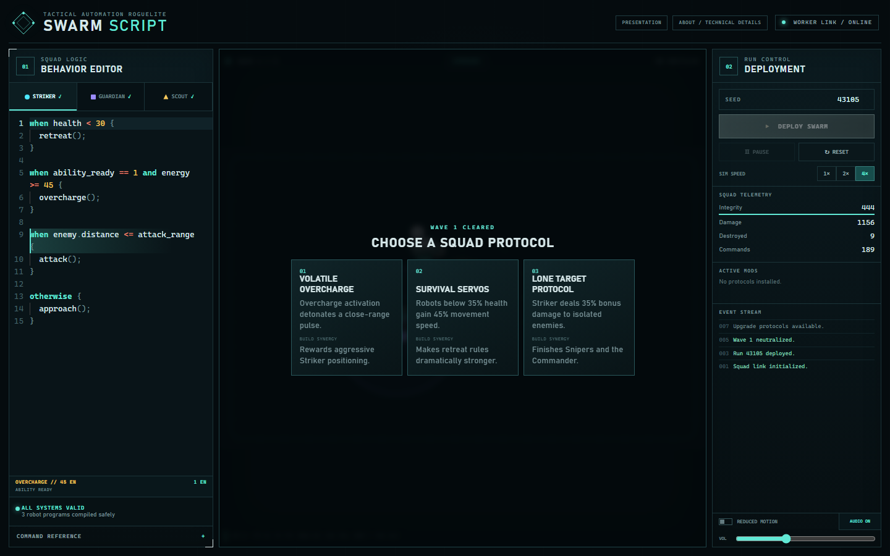
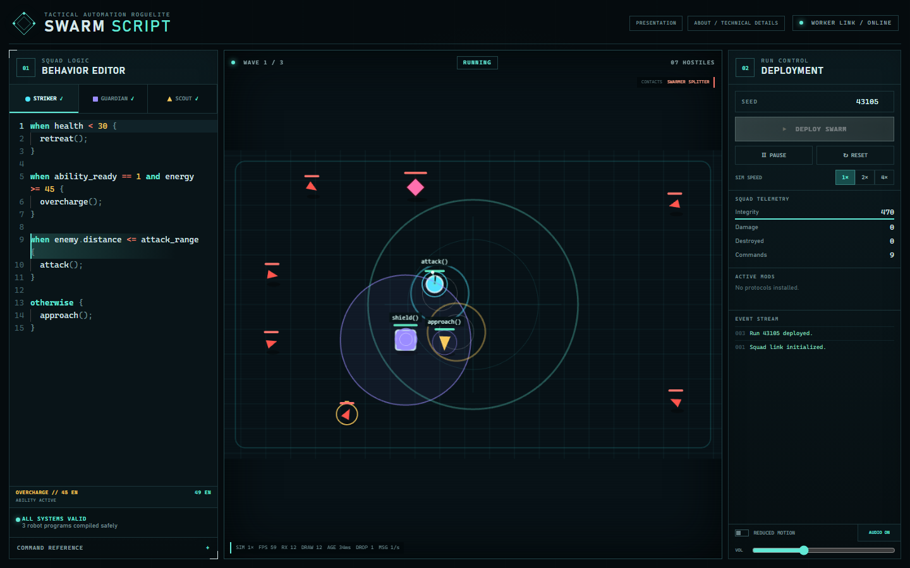
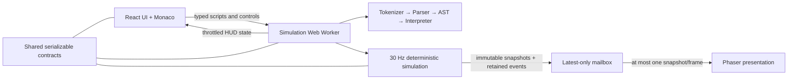

# Swarm Script

**Program your squad. Watch the logic fight.**

Swarm Script v0.2 is a desktop-first tactical automation roguelite. Program a Striker, Guardian, and Scout with a small safe rule language, then watch those rules fight through a deterministic three-wave arena.

[Play the live game](https://swarm-script.vercel.app/) · [Technical architecture](https://swarm-script.vercel.app/architecture) · [Detailed architecture notes](docs/ARCHITECTURE.md)



## What changed in v0.2

- Fixed the 2×/4× rendering freeze with a latest-only snapshot mailbox, render-side interpolation, and event-ID deduplication.
- Made movement 50–70% faster, with acceleration, deceleration, separation, knockback, projectile trails, and role-specific silhouettes.
- Added programmable role abilities: Striker `overcharge()`, Guardian `shield()`, and Scout `mark()`.
- Added tactical sensors including `ability_ready`, `ability_cooldown`, `enemy.marked`, and `allies_under_threat`.
- Added five enemy families: Swarmers, Snipers, Splitters, Bulwarks, and a Commander boss.
- Added 15 seeded upgrades with explicit build synergies and a final-build recap.
- Added a shared death presentation pipeline and procedural Web Audio effects with mute, volume, and reduced-motion controls.
- Added source-linked active/blocked decision highlighting and separate simulation/render debug metrics.

## Gameplay

1. Open [the game](https://swarm-script.vercel.app/play) at 1024 pixels wide or above.
2. Edit the three ordered behavior scripts, or deploy the playable defaults.
3. Observe the first matching rule, its highlighted source line, and each robot's energy and ability state.
4. Choose one of three seeded squad protocols after waves one and two.
5. Adapt to readable enemy counters and clear wave three for a checksum-backed run analysis.

The default seed, `43105`, is a representative winning scenario. A normal successful run is tuned toward 2–3 minutes; pause and 1×/2×/4× controls support closer inspection or fast iteration.



## Build choices

Two seeded drafts create a compact build during each run. Most protocols change behavior—chain shots, piercing, Shield reflection, spreading Marks, close-range explosions, or ability economies—while a few clear stat foundations keep choices approachable. Cards state their synergy and the result screen records the final pair.



## Abilities and safe scripting



The language supports ordered `when` rules, `otherwise`, boolean composition, comparisons, whitelisted sensors, and a fixed command set. There is no `eval`, generated JavaScript, user function execution, or host-object access. The tokenizer, recursive-descent parser, typed AST, validation, and budgeted interpreter are all project code.

Role abilities are real commands with deterministic energy costs, cooldowns, duration, trace results, metrics, and failure reasons:

- Striker: `overcharge()` — a temporary offensive surge.
- Guardian: `shield()` — protects nearby allies and can reflect with the right upgrade.
- Scout: `mark()` — designates a hostile for amplified squad damage.

## Technical highlights

- Deterministic 30 Hz authority with stable entity order, seeded xorshift32 randomness, seeded upgrades, and an FNV-1a checksum.
- Typed Web Worker protocol keeps combat independent from React, Monaco, Phaser, and display cadence.
- A single-slot `GameBridge` mailbox lets Phaser consume only the newest snapshot per render frame; dropped stale snapshots are measured, not replayed.
- Combat events survive snapshot replacement through short retention and unique IDs, preventing duplicate deaths, audio, shake, and hit-stop.
- Phaser owns presentation only; React receives separately throttled HUD state.
- Strict TypeScript monorepo boundaries across shared contracts, scripting, simulation, and the web client.
- 25 Vitest tests cover scripting, combat, abilities, archetypes, deterministic builds, balance, worker speed switching, and mailbox behavior.
- Playwright exercises the shipped UI, rapid 1×/2×/4× switching, pause/resume, audio and motion settings, upgrade drafting, results, responsive layout, route refreshes, and browser errors.

## Architecture



- `packages/shared` owns serializable domain types and worker messages.
- `packages/scripting` owns parsing, validation, diagnostics, and interpretation.
- `packages/simulation` owns all authoritative combat state and rules, with no DOM or renderer dependency.
- `apps/web` owns React presentation, Monaco, the worker host, procedural audio, and Phaser.

See [docs/ARCHITECTURE.md](docs/ARCHITECTURE.md) for the freeze root cause, message flow, state ownership, determinism, and performance model. See [docs/GAME_DESIGN.md](docs/GAME_DESIGN.md) for abilities, counters, builds, and balance.

## Local development

Requirements: Node.js 24 and pnpm 11.9+.

```bash
pnpm install --frozen-lockfile
pnpm dev
```

No backend, account, environment variable, or external asset service is required.

## Verification

| Command             | Purpose                                                                   |
| ------------------- | ------------------------------------------------------------------------- |
| `pnpm verify`       | Lint, format, typecheck, unit/integration tests, build, and browser tests |
| `pnpm test`         | DSL, simulation, balance, bridge, and worker tests                        |
| `pnpm test:e2e`     | Real browser gameplay and responsive presentation flow                    |
| `pnpm build`        | Build all packages and the Vite production client                         |
| `pnpm typecheck`    | Strict TypeScript across every package                                    |
| `pnpm lint`         | ESLint                                                                    |
| `pnpm format:check` | Prettier check                                                            |

To test a deployment, set `PLAYWRIGHT_BASE_URL=https://swarm-script.vercel.app` and run `pnpm test:e2e`. In PowerShell: `$env:PLAYWRIGHT_BASE_URL='https://swarm-script.vercel.app'`.

## Current limitations

- The playable game needs a desktop viewport at least 1024 pixels wide; narrower screens receive a friendly fallback.
- Balance is deterministic and measured, but still based on automated seeds rather than a broad human playtest cohort.
- The DSL has no user variables, reusable functions, robot-to-robot messages, or timeline scrubber.
- Replay files and shareable challenge links are not implemented.
- Procedural geometry and synthesized audio intentionally replace a larger external asset pipeline.

## License

[MIT](LICENSE)
