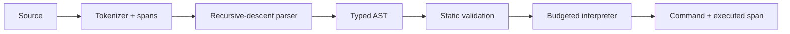

# Architecture

## Package boundaries

`shared` contains only serializable contracts. `scripting` depends on those spans and command names. `simulation` depends on shared contracts and the safe interpreter. `web` depends on all three, but no lower package depends on React, Phaser, workers, or browser APIs.

This dependency direction keeps authoritative rules testable in Node and prevents renderer lifetimes from leaking into game state.

## Worker boundary

The main thread sends compile, run control, speed, upgrade, and reset messages. `SimulationHost` converts them into scripting and simulation operations. The browser worker advances one 30 Hz frame timer and can run 1, 2, or 4 fixed simulation steps per timer callback.

Worker responses separate concerns:

- `WORLD_SNAPSHOT` drives Phaser at 15 Hz and a throttled React HUD at roughly 5 Hz.
- `DECISION_TRACE` drives short source-command labels.
- phase messages drive upgrades, event feed entries, and results.
- compile messages carry per-robot diagnostics with exact source spans.

The host is independently integration-tested without constructing a browser Worker.

## Simulation/render separation

`SwarmSimulation` owns positions, health, energy, cooldowns, targeting, projectiles, waves, upgrades, phases, metrics, and checksums. Phaser receives immutable snapshots through `GameBridge`. `BattleScene` turns snapshots into geometry and effects; it cannot change authoritative entities.

The renderer interpolates between each entity's previous and current fixed-step position. Death bursts and labels are disposable view state. Losing them cannot alter a run.

## DSL pipeline

The grammar gives `not` higher precedence than `and`, and `and` higher precedence than `or`. Comparisons accept numeric literals or whitelisted sensor values. Rules run in source order and the first match wins. `otherwise` has a null condition and acts as a fallback.

Unknown characters, syntax, values, and commands create human-readable diagnostics. The interpreter spends budget units while visiting rules and expressions. Budget exhaustion returns `wait()` rather than executing unbounded work.

## State ownership

- React: scripts being edited, control selection, low-frequency display values, overlays, accessibility settings
- Worker: compiled ASTs, run instance, simulation speed
- Simulation: complete authoritative run state
- Phaser: graphics, transient labels, bursts, camera/presentation timing

No mutable global game state exists. The bridge is a scoped event boundary and carries snapshots only.

## Deterministic replay model

Runs are functions of script ASTs, numeric seed, and ordered upgrade choices. The simulation:

- advances only in 1/30-second steps;
- uses xorshift32 instead of `Math.random()`;
- assigns monotonically increasing stable IDs;
- resolves actors and projectiles in stable array order;
- chooses upgrades from the seeded generator;
- produces an FNV-1a checksum from stable final-state data.

Wall-clock time affects presentation and worker scheduling, not authoritative integration. A future replay file needs only version, seed, scripts, and upgrade selections.

## Performance model

The vertical slice bounds entities to a compact three-wave encounter. A static Phaser `Graphics` object holds the arena; reused dynamic objects draw actors and effects. Snapshots are intentionally plain structured-clone data with no histories or renderer metadata. React updates are throttled separately from canvas updates.

Simulation rate is 30 Hz, decision rate is 5 Hz, render snapshots are 15 Hz, and normal display cadence is the browser's frame rate. These values keep decisions legible, combat responsive, and worker traffic modest.

## Important trade-offs

- Full snapshots are simpler and safer than state deltas at this entity count. A larger game should add versioned deltas.
- Graphics primitives make iteration and silhouette tuning fast but do not yet use instanced GPU layers.
- A direct Monaco integration avoids a wrapper dependency, though editor payload remains the largest client cost.
- Collision is targeted projectile arrival rather than a physics engine; this preserves determinism and fits the initial combat model.
- The debug overlay is currently always visible as a portfolio surface; a production release should gate it behind a developer flag.
