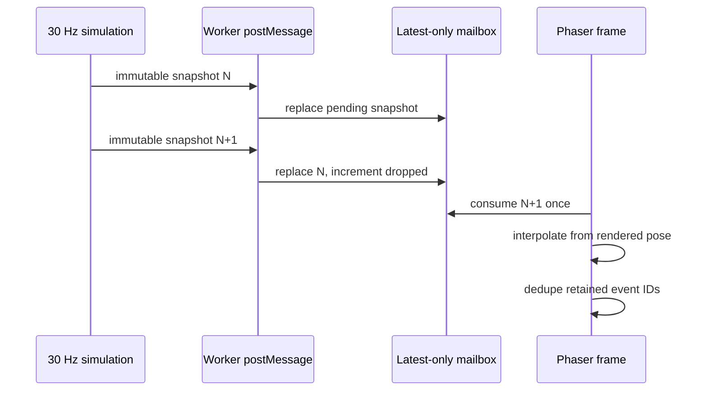
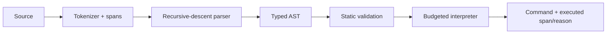

# Architecture

## Package boundaries

`shared` contains serializable contracts. `scripting` owns the safe language. `simulation` depends on those contracts and the interpreter. `web` depends on all three, but no lower package depends on React, Phaser, Web Workers, Web Audio, or browser APIs.

This direction keeps combat authoritative and testable in Node while presentation can be destroyed or delayed without changing a run.

## Worker boundary

The main thread sends compile, run control, speed, upgrade, and reset messages. `SimulationHost` advances one 30 Hz timer and performs exactly 1, 2, or 4 fixed simulation steps per callback. Speed changes therefore alter simulation throughput, never `dt` or authoritative rules.

Worker responses separate concerns:

- `WORLD_SNAPSHOT` carries immutable world state, retained combat events, metrics, and the applied build.
- `DECISION_TRACE` identifies the chosen source span, whether it executed, and a failure reason when blocked.
- phase messages drive upgrades, the event feed, and results.
- compile messages carry per-robot diagnostics with exact source spans.

The host is integration-tested without constructing a browser Worker, including the exact tick sequence across 1×, 2×, 4×, and pause.

## Rendering-freeze root cause and fix

In v0.1, every arriving snapshot synchronously notified `BattleScene`. At higher simulation speeds, snapshots could arrive faster than a frame could present them. The scene restarted interpolation from the simulation's previous-tick coordinates for each notification, so queued snapshots repeatedly reset visible movement. Entity disappearance was also inferred separately on each snapshot; repeated transitions could extend hit-stop and recreate work while the worker continued correctly.

v0.2 makes the boundary explicitly lossy for state and reliable for events:

1. `GameBridge.publishSnapshot()` replaces one pending snapshot slot. It never grows a queue.
2. `BattleScene.update()` consumes at most one newest snapshot per browser frame.
3. Interpolation begins at the entity's currently rendered position and targets the newest authoritative position.
4. Combat events remain in snapshots for a short tick window and carry unique IDs.
5. The renderer deduplicates event IDs, so dropped state snapshots do not lose deaths, while repeated snapshots cannot replay audio, shake, or hit-stop.
6. A debug overlay exposes simulation speed, render FPS, received tick, drawn tick, snapshot age, dropped snapshots, and message rate.

The worker can now advance independently at 4× while the display remains responsive. Dropped intermediate state is expected; the newest state is authoritative.

## Simulation/render separation

`SwarmSimulation` owns positions, velocity, facing, health, energy, cooldowns, abilities, targeting, projectiles, archetype state, waves, upgrades, phases, events, metrics, and checksums. Phaser can only interpret snapshots.

`BattleScene` owns geometry, labels, trails, telegraphs, marks, shield rings, flashes, fragments, camera movement, hit-stop, and calls into procedural audio. A reusable death presenter handles every archetype with an intensity tier. All transient objects have bounded lifetimes and collection caps.

## DSL pipeline

`not` binds tighter than `and`, and `and` tighter than `or`. Comparisons accept literals or whitelisted sensors. Rules run in source order; the first match wins. `otherwise` is the fallback. Unknown characters, syntax, values, and commands produce diagnostics. Budget exhaustion returns `wait()`.

v0.2 adds role commands `overcharge()`, `shield()`, and `mark()` plus tactical sensors without adding any dynamic execution path.

## State ownership

- **React:** editable scripts, selected controls, throttled display state, overlays, volume/mute, and reduced-motion preference.
- **Worker:** compiled ASTs, run instance, and selected simulation speed.
- **Simulation:** complete authoritative run and deterministic event history.
- **GameBridge:** one pending snapshot, traces, and observed render-transport metrics.
- **Phaser:** visual objects and presentation timing.
- **AudioEngine:** lazily unlocked browser audio graph and non-authoritative sound throttling.

## Determinism

A run is a function of version, script ASTs, numeric seed, and ordered upgrade choices. The simulation:

- advances only in 1/30-second fixed steps;
- uses xorshift32, never `Math.random()`;
- assigns monotonically increasing stable IDs;
- resolves actors, projectiles, splits, chains, and upgrades in stable order;
- records unique combat-event IDs;
- hashes stable final-state and build data with FNV-1a.

Wall-clock scheduling, render FPS, audio, reduced motion, and dropped snapshots do not affect the checksum.

## Performance model

Simulation runs at 30 Hz and decisions at 5 Hz. Snapshots are emitted at a bounded rate and are plain structured-clone data. The main thread intentionally keeps no snapshot history. React HUD state is separately throttled, and Phaser renders at browser cadence.

The arena background is static geometry. Actor/effect graphics are reused where practical, transient collections are capped, processed event IDs are pruned, and audio has per-type stacking limits. Full snapshots remain simpler and safer than deltas at this entity count.

## Testing boundaries

- DSL tests verify syntax, precedence, allowed commands/sensors, diagnostics, and the absence of dynamic execution.
- Simulation tests verify deterministic checksums, split children, all archetypes, Commander telegraphs, ability resources, upgrades, one death event per entity, victory, and defeat.
- The balance harness runs a repeatable multi-seed cohort and reports outcomes, duration, contribution, abilities, upgrades, and failure causes.
- Worker tests verify protocol transitions and speed/pause tick behavior.
- Bridge tests verify newest-only consumption and dropped-snapshot accounting.
- Playwright verifies the real lazy-loaded worker/Monaco/Phaser path, rapid speed switching, settings, screenshots, direct routes, responsive behavior, and browser errors.

## Trade-offs

- Full snapshots are appropriate for this bounded arena; a larger game should add versioned deltas without reintroducing a replay queue.
- Procedural primitives and synthesized audio provide consistent feedback with no asset licensing or loading cost, but limit visual and sonic variety.
- Targeted projectile arrival avoids a physics engine and preserves determinism, but does not model continuous collision bodies.
- The performance overlay is intentionally visible for v0.2 validation; a consumer release would gate it behind a developer setting.
